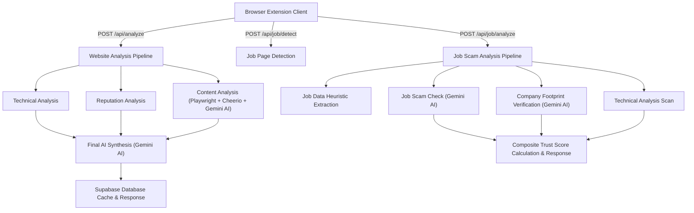

# 🛡️ ClickSafe Backend

ClickSafe (internally named **VeriWeb**) is a real-time, production-ready website security and recruitment/job scam analysis API service. Built on **Node.js**, **Express**, and **Supabase**, ClickSafe performs deep technical scanning, reputation analysis, and content evaluation to instantly detect fraudulent websites, phishing attempts, task scams, and fake employment listings.

It is designed to serve as the backend engine powering client applications, browser extensions, and security tools.

---

## 🏗️ High-Level Architecture

The backend exposes two specialized threat evaluation pipelines:



---

## 🚀 Key Features

### 1. 🌐 Website Scam & Phishing Analysis Pipeline
* **Parallel Technical Analysis**: Establishes a TLS connection to check SSL validity, resolves WHOIS registration age, parses DNS records (`A`, `AAAA`, `MX`, `NS`), determines IP/Hosting geolocation (`ip-api.com`), and follows up to 10 HTTP redirect hops.
* **Reputation Lookup**: Cross-checks domain reputation via VirusTotal, scans host IP abuse reports in AbuseIPDB, queries live phishing detections via urlscan.io, and runs a Gemini AI social sentiment search to check for Reddit/forum complaints.
* **AI Content Audit**: Launches headless Playwright browsers to scrape website content, extracts visible text, buttons, forms, and policies, then uses Gemini AI to flag dark patterns, fake urgency, brand impersonation, and hidden elements.
* **Final AI Synthesis**: Amalgamates all technical parameters, reputation databases, and on-page content into a final trust verdict using Gemini AI.

### 2. 💼 Job Scam & Recruitment Fraud Pipeline
* **Heuristic Job Site Detection**: Analyzes URLs and page layouts for keywords, "Apply" actions, and CTC/salary references to auto-detect job pages.
* **Job Scam Check**: Assesses salary/compensation legitimacy, filters "too-good-to-be-true" offers, and checks public discussions for task scams or hiring fraud warnings.
* **Company Footprint Verification**: Performs domain-alignment checks on recruiter contact email domains vs. corporate domains, checks social footprint, and flags recruiters using personal webmail (e.g. `@gmail.com`).
* **Composite Trust Score**: Weights scam parameters, digital footprint registration, email match alignments, and domain age into a single unified trust rating.

### 3. ⚡ Smart Caching & DB Persistence
* Checks local cache in a **Supabase PostgreSQL database** using normalized URL lookups before launching resource-intensive external APIs or AI pipelines. Saves execution latency and API token usage.

---

## 📂 Project Structure

```text
ClickSafe-Backend/
├── src/
│   ├── server.js              # Application entry point & database connection verifier
│   ├── app.js                 # Express server initialization & middleware stack
│   ├── config/
│   │   └── supabase.js        # Supabase Client configuration instance
│   ├── controllers/
│   │   ├── analysis.controller.js  # Website threat analysis pipeline orchestrator
│   │   └── job.controller.js       # Job page detection & analysis pipeline orchestrator
│   ├── routes/
│   │   ├── analysis.routes.js      # Routes for website scanning (/api/analyze)
│   │   └── job.routes.js           # Routes for job checks (/api/job)
│   ├── services/
│   │   ├── database/
│   │   │   └── database.service.js # Supabase CRUD queries & cache checks
│   │   ├── jobs/
│   │   │   └── jobs.service.js     # AI job scam & footprint verification routines
│   │   ├── reputation/
│   │   │   └── reputation.service.js # VT, AbuseIPDB, URLScan.io & AI sentiment checks
│   │   └── technical/
│   │       ├── technical.service.js  # Orchestrates technical checks in parallel
│   │       ├── ssl.service.js        # TLS peer certificate examiner
│   │       ├── whois.service.js      # Domain age and registry parser
│   │       ├── dns.service.js        # DNS records (A, AAAA, MX, NS) resolver
│   │       ├── hosting.service.js    # IP resolution & geolocation details
│   │       └── redirect.service.js   # Follows redirect chains up to 10 hops
│   ├── scraper/
│   │   ├── playwright/
│   │   │   ├── playwrightOrchestrator.js # Master browser crawl coordinator
│   │   │   ├── websiteCrawler.js         # BFS same-domain URL web crawler
│   │   │   ├── pageSelector.js           # Selects high-value trust pages (About, Contact, etc.)
│   │   │   ├── pageCollector.js          # Captures page HTML and titles
│   │   │   └── scrapeSinglePage.js       # Lightweight single-url page crawler
│   │   └── extractor/
│   │       ├── contentExtractor.js       # Cheerio orchestrator for text/form/link extraction
│   │       ├── linkExtractor.js          # Classifies links (internal, external, social, tel, mailto)
│   │       ├── formExtractor.js          # Analyzes form elements & inputs (LOGIN, PAYMENT, etc.)
│   │       ├── claimsExtractor.js        # Scans for urgency, guarantees, or certifications
│   │       ├── policyExtractor.js        # Maps privacy, terms, shipping, refund pages
│   │       ├── statisticsExtractor.js    # Calculates word counts and counts by element
│   │       └── aggregator/
│   │           └── websiteAggregator.js  # Merges multiple page datasets into a single object
│   ├── ai/
│   │   ├── gemini/
│   │   │   └── geminiClint.js        # Shared Gemini API client connector
│   │   ├── Prompt/
│   │   │   ├── contentprompt.js      # System instructions for content auditing
│   │   │   └── finalReportprompt.js  # System instructions for synthesis
│   │   ├── context/
│   │   │   ├── contentContextBuilder.js # Prepares crawled data for Gemini content check
│   │   │   └── finalContextBuilder.js   # Prepares combined inputs for synthesis
│   │   ├── agents/
│   │   │   ├── contentAgent.js       # Invokes content audit and validates output
│   │   │   └── finalReportAgent.js   # Invokes final synthesis and validates output
│   │   ├── schemas/
│   │   │   ├── contentReportSchema.js # Zod validators for content report
│   │   │   └── finalReportSchema.js   # Zod validators for master report
│   │   └── aiOrchestrator.js         # Barrel exports for AI agents
│   ├── pageDetection/
│   │   └── isJobPage.js              # Heuristic job page layout classifier
│   └── utils/
│       ├── responseParser.js         # Strips code fences and parses raw AI JSON output
│       └── textcleaner.js            # Standardizes and sanitizes whitespace
├── .env.example               # Config template containing required api credentials
├── nodemon.json               # Reloader config monitoring the src/ folder
├── package.json               # Dependencies, meta info and running scripts
└── FEATURES.md                # In-depth application feature breakdown
```

---

## 🛠️ Tech Stack & Dependencies

* **Runtime**: [Node.js](https://nodejs.org/) (v18+)
* **Framework**: [Express.js](https://expressjs.com/) (v5.x)
* **Database**: [Supabase](https://supabase.com/) (`@supabase/supabase-js`)
* **Core Packages**:
  * `@google/genai` & `@google/generative-ai` for Gemini AI integration.
  * `playwright` for headless browser crawls.
  * `cheerio` for light, high-performance HTML parsing.
  * `axios` for HTTP redirections and geolocation lookups.
  * `whois-json` for automated WHOIS queries.
  * `zod` for strict runtime API schema validations.
  * `helmet` and `cors` for HTTP header security and cross-origin resource sharing.

---

## ⚙️ Getting Started

### 1. Database Configuration
Create the target table in your Supabase SQL Editor:
```sql
CREATE TABLE analysis_reports (
    id UUID PRIMARY KEY DEFAULT gen_random_uuid(),
    url TEXT NOT NULL,
    technical_report JSONB NOT NULL,
    content_report JSONB NOT NULL,
    reputation_report JSONB NOT NULL,
    ai_report JSONB NOT NULL,
    trust_score NUMERIC,
    risk_level TEXT,
    created_at TIMESTAMP WITH TIME ZONE DEFAULT timezone('utc'::text, now()) NOT NULL
);
```

### 2. Installation
```bash
# Clone the repository
git clone https://github.com/your-username/ClickSafe-Backend.git
cd ClickSafe-Backend

# Install packages
npm install
```

### 3. Environment Setup
Create a `.env` file in the root folder (using `.env.example` as a template):
```ini
PORT=5000
SUPABASE_URL=https://your-project-id.supabase.co
SUPABASE_KEY=your-supabase-service-role-or-anon-key
GEMINI_API_KEY=your-gemini-api-key
VIRUSTOTAL_API_KEY=your-virustotal-api-key
ABUSEIPDB_API_KEY=your-abuseipdb-api-key
URLSCAN_API_KEY=your-urlscan-api-key
```

### 4. Running the App
* **Development Mode** (auto-reload via nodemon):
  ```bash
  npm run dev
  ```
* **Production Mode**:
  ```bash
  npm start
  ```

---

## 📡 API Reference

### 1. Health Status
Check if the ClickSafe service and connection are live.
* **Method & Route**: `GET /`
* **Response (200 OK)**:
  ```json
  {
    "success": true,
    "message": "🚀 VeriWeb Backend is running"
  }
  ```

---

### 2. Website Scan Pipeline
Executes the website safety audit pipeline.
* **Method & Route**: `POST /api/analyze` or `POST /api/analyze/websiteSearch`
* **Headers**: `Content-Type: application/json`
* **Request Body**:
  ```json
  {
    "url": "https://example-phishing-site.com"
  }
  ```
* **Response (200 OK)**:
  ```json
  {
    "success": true,
    "url": "https://example-phishing-site.com",
    "analysisId": "8f8e02bc-33d3-466d-a7b6-e26b840801d9",
    "technical": {
      "ssl": { "valid": true, "issuer": "Let's Encrypt", "expires_in_days": 12 },
      "whois": { "creationDate": "2026-07-01", "domainAgeDays": 28 },
      "dns": { "A": ["192.0.2.1"], "MX": [] },
      "redirects": { "redirectCount": 0, "finalUrl": "https://example-phishing-site.com" },
      "hosting": { "isp": "Cloudflare", "country": "United States" }
    },
    "website": { "statistics": { "totalPages": 2, "totalForms": 1 } },
    "contentAi": { "riskScore": 75, "brandImpersonation": { "detected": true, "targetBrand": "PayPal" } },
    "reputationReport": { "virusTotal": { "risk": "MEDIUM" }, "urlScan": { "safe": false } },
    "finalReport": {
      "trustScore": 25,
      "riskLevel": "High",
      "summary": "This site appears to impersonate the PayPal login portal.",
      "positiveSignals": ["Valid SSL certificate"],
      "negativeSignals": ["Brand impersonation detected", "Young domain registration age"],
      "reasons": ["Impersonating financial institution", "Domain registered less than 30 days ago"],
      "recommendation": "Critical security concerns detected. Do not enter credentials."
    }
  }
  ```

---

### 3. Detect Job Posting Layout
Determines if a page is a job description layout.
* **Method & Route**: `POST /api/job/isJobSite` or `POST /api/job/detect`
* **Request Body** (if client HTML is omitted, the server will crawl it):
  ```json
  {
    "url": "https://example-careers.com/jobs/software-engineer",
    "html": "<html>...</html>"
  }
  ```
* **Response (200 OK)**:
  ```json
  {
    "success": true,
    "url": "https://example-careers.com/jobs/software-engineer",
    "isJob": true,
    "isJobSite": true,
    "confidence": 95
  }
  ```

---

### 4. Job Scam Verification
Analyzes job elements, recruiter reputation, email alignment, and suspicious listings.
* **Method & Route**: `POST /api/job/jobSearch` or `POST /api/job/analyze`
* **Request Body**:
  ```json
  {
    "url": "https://scam-job-listing.com/apply",
    "html": "<html>...</html>"
  }
  ```
* **Response (200 OK)**:
  ```json
  {
    "success": true,
    "url": "https://scam-job-listing.com/apply",
    "technical": { ... },
    "jobData": {
      "company": { "name": "Fake Corp", "website": "https://fakecorp.com" },
      "recruiter": { "name": "Spammer", "email": "fakecorp@gmail.com" },
      "job": { "title": "Data Entry", "salary": { "disclosed": true, "values": ["$50/hour"] } }
    },
    "finalReport": {
      "trustScore": 30,
      "riskLevel": "high",
      "confidence": 90,
      "summary": "Recruiter uses personal Gmail. Company has no verified digital presence.",
      "positiveSignals": [],
      "negativeSignals": ["Recruiter uses personal webmail", "No corporate digital footprint found"],
      "reasons": ["Gmail address used for corporate hiring", "Salary is highly inflated for Data Entry"],
      "recommendation": "Verify recruiter identity. Avoid sharing bank details or deposits."
    }
  }
  ```

---

## 🛡️ License

This project is licensed under the **ISC License**. Feel free to use and adapt this system for your security applications.
